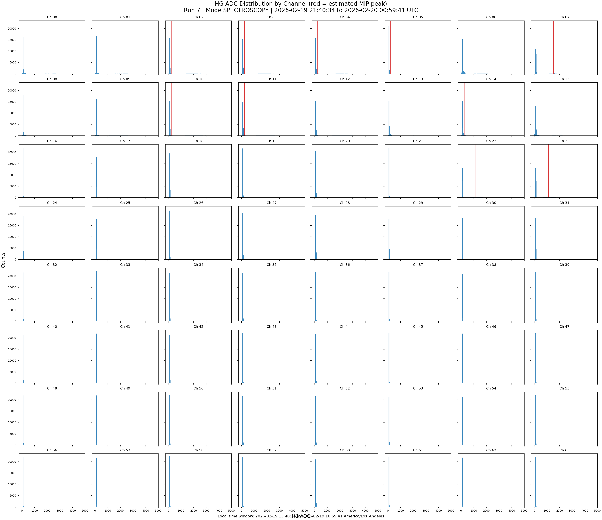
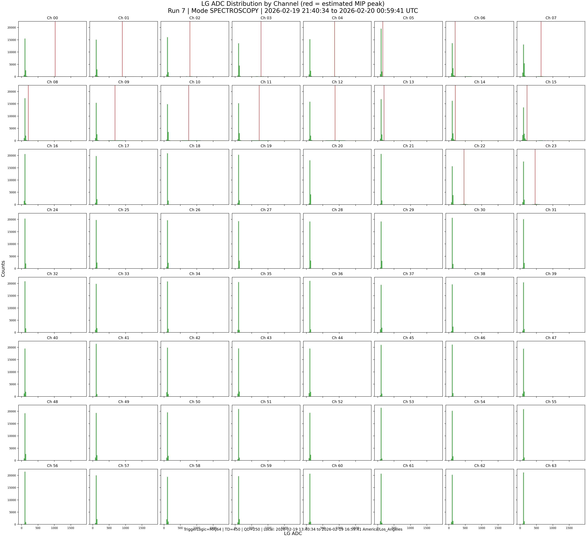
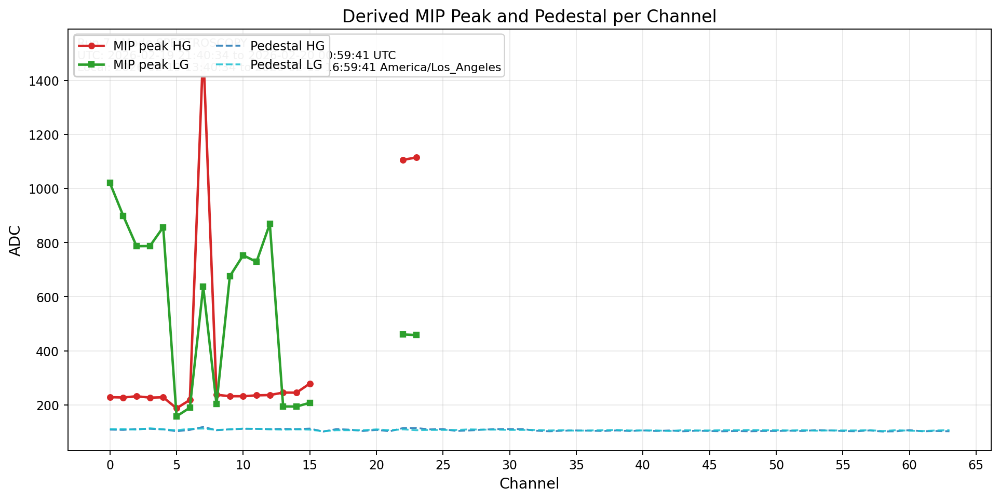
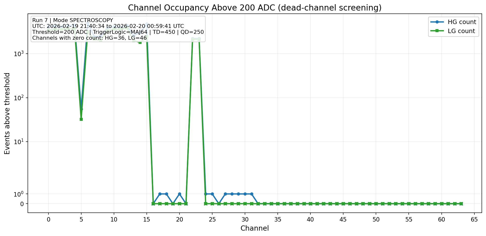
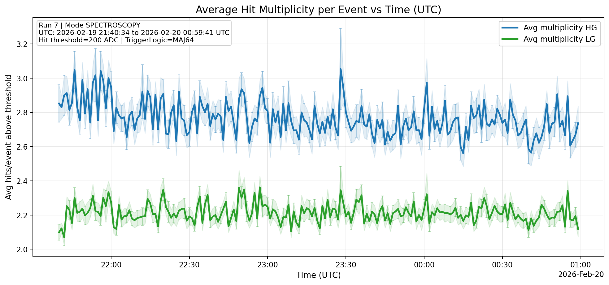
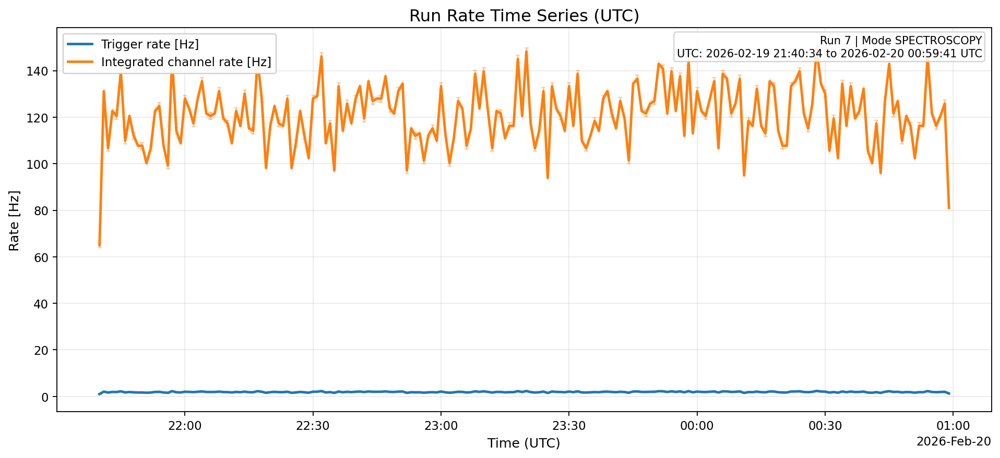
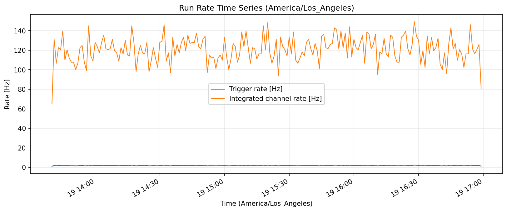
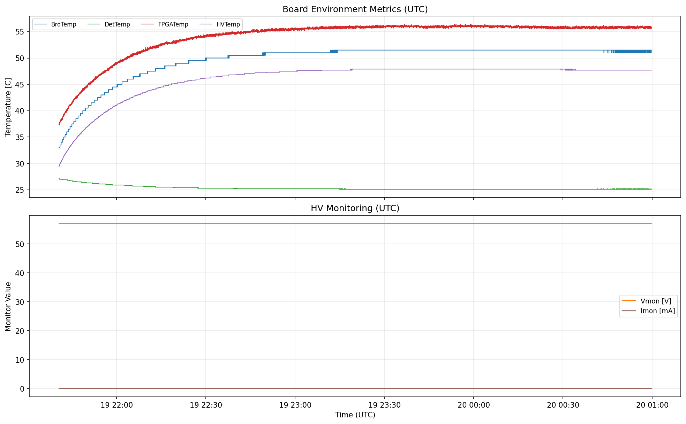

# QA Analysis for Janus/DT5202 Runs

This repository contains a reproducible QA workflow for Janus ASCII list data with companion run metadata and service-monitoring logs.
The pipeline auto-detects acquisition mode from metadata/list headers and selects the plot profile accordingly.

The current commit includes `Run7` data and generated outputs:

- `data/raw/Run7_list.txt`
- `data/raw/Run7_Info.txt`
- `data/raw/Run7_ServiceInfo.txt`

## What the pipeline produces

- Per-channel ADC distributions for both HG and LG with estimated MIP peak overlays
- Derived MIP peak position per channel (HG + LG)
- Run-level rate time series in:
  - UTC
  - America/Los_Angeles
  - trigger rate only, with statistical uncertainties (Poisson error bars/bands)
- Channel threshold-pass summary (`ADC >= 200` by default) to identify possible dead channels
- Average hit multiplicity per event vs time (hit defined as `ADC >= threshold`)
- Service-monitoring trends (temperatures, Vmon, Imon)
- QA tables (`CSV` + `JSON`) and a lightweight HTML dashboard

## Run the analysis

```bash
python -m pip install -r requirements.txt
python src/generate_qa_report.py
```

Optional arguments:

```bash
python src/generate_qa_report.py ^
  --list-file data/raw/Run7_list.txt ^
  --info-file data/raw/Run7_Info.txt ^
  --service-file data/raw/Run7_ServiceInfo.txt ^
  --outdir outputs ^
  --timezone America/Los_Angeles ^
  --rate-bin-sec 60 ^
  --channel-threshold-adc 200
```

## Metadata snapshot (Run7)

From `Run7_Info.txt` and list-file header:

- Run number: `7`
- Local start/stop (as reported): `19/02/2026 13:40:34` to `19/02/2026 16:59:42`
- UTC start from list header: `2026-02-19T21:40:34+00:00`
- Acquisition mode: `SPECTROSCOPY`
- Trigger logic: `MAJ64` (majority level `2`)
- Gain select: `BOTH` (`HG_Gain=25`, `LG_Gain=55`)
- Common pedestal setting: `100`
- HV bias: `57 V`
- List file format version: `3.3`

## QA summary (generated from Run7)

From `outputs/tables/summary_metrics.json`:

- Events: `22,643`
- Channels: `64`
- Samples: `1,449,152` (64 samples/event)
- Event-span duration: `11,946.30 s`
- Average trigger rate: `1.895 Hz`
- Detected mode: `SPECTROSCOPY`
- Gain select: `BOTH`
- Trigger logic / thresholds: `MAJ64`, `TD=450`, `QD=250`
- Threshold-pass summary threshold: `200 ADC`
- HG channels with MIP-peak estimate: `18`
- LG channels with MIP-peak estimate: `18`
- Mean estimated MIP peak (HG): `401.424 ADC`
- Mean estimated MIP peak (LG): `559.876 ADC`
- Channels with zero counts above 200 ADC: `HG=36`, `LG=46`
- Average hit multiplicity above 200 ADC: `HG=2.7665`, `LG=2.2128`

## Plots

### HG ADC per channel (with estimated MIP peak marker + run timestamp labels)



### LG ADC per channel (with estimated MIP peak marker + run timestamp labels)



### Derived MIP peak position per channel (HG + LG)



### Channel counts above threshold (dead-channel screening)



### Average hit multiplicity per event vs time (UTC)



### Trigger rate time series (UTC, with statistical uncertainty)



### Trigger rate time series (America/Los_Angeles, with statistical uncertainty)



### Service monitoring (UTC)



## Dashboard and tables

- Dashboard: `outputs/dashboard/index.html`
- Channel metrics: `outputs/tables/channel_metrics.csv`
- Channel threshold summary: `outputs/tables/channel_threshold_summary.csv`
- Hit multiplicity time series: `outputs/tables/hit_multiplicity_timeseries.csv`
- Rate series: `outputs/tables/rate_timeseries.csv`
- Parsed metadata: `outputs/tables/run_metadata.json`
- Summary metrics: `outputs/tables/summary_metrics.json`
